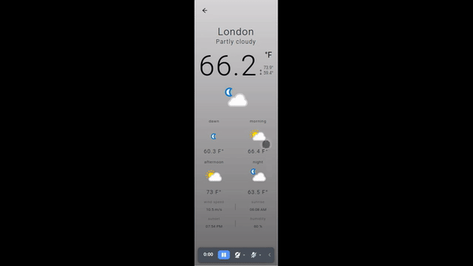

# ForecastThi 😉

## About

A weather webapp to follow your city's forecast.

## Screenshots

<div align="center" id="top">
  
</div>
<br/>

## Features

- API usage by serverless.
- Layout based on mobile users.
- micro-front-end architecture.
- Unitary test with jest and storybook.

## Technologies

The following tools were used in this project:

- [React](https://pt-br.reactjs.org/)
- [TypeScript](https://typescriptlang.org/)
- [Next](https://nextjs.org)
- [Jest](https://jestjs.io/)
- [Storybook](https://storybook.js.org)

## Requirements

Before starting 🏁, you need to have [Git](https://git-scm.com) and [Node](https://nodejs.org/en/) installed, and an account on [weather api](https://www.weatherapi.com/) to access the weather public api.

After created your account on the Weather org you'll have to get your private api key and fill up the .env file with your key.

- [Step by step guide to get the api key](https://www.weatherapi.com/docs/)

### Starting

```bash
# Clone this project
$ git clone git@github.com:Thiago-spart/tds-challenger.git

# Access
$ cd tds-challenger

# Install dependencies
$ npm i

# Run the project in developer mode
$ npm run dev

# The server will initialize in <http://localhost:3000>
```

## License

This project is under license from Apache. For more details, see the [LICENSE](LICENSE).

Made with ❤️ and ☕

<a href="#top">Back to top</a>
